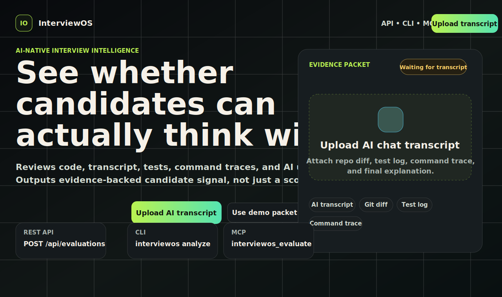
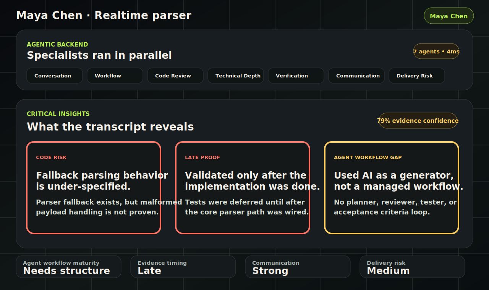

<div align="center">

# InterviewOS

### Evaluate the engineer, not just the code.

InterviewOS is an **AI-native interview intelligence platform**. It evaluates how candidates think, verify, communicate, and supervise AI while building software.

It is not a cheating detector. It is a thinking detector for the AI-assisted engineering era.

<br />

<strong>REST API</strong> · <strong>CLI</strong> · <strong>MCP Server</strong> · <strong>Hackathon Demo UI</strong>

</div>

---

## Working Demo

### 1. Open Screen

The first screen frames the product as an integration-ready interview harness, not just a dashboard.



### 2. After “Use Demo Packet”

The backend runs specialist agents in parallel and reveals evidence-backed candidate insights.



---

## What InterviewOS Does

Modern candidates use Codex, Claude, Copilot, Cursor, Antigravity, and other AI-enabled development tools. The differentiator is no longer only whether someone can type code from memory.

The real signal is whether they can:

- frame ambiguous requirements
- decompose work clearly
- delegate to AI with judgment
- detect hallucinated or unsafe AI output
- verify generated code instead of trusting it blindly
- communicate tradeoffs and residual risk
- organize a codebase cleanly
- debug methodically
- understand production, security, and reliability concerns

InterviewOS turns that process into structured hiring signal.

Example insight:

> Candidate ran tests only after final implementation and did not add coverage for edge cases. They accepted an AI-generated parser without validating malformed input.

---

## Product Surfaces

InterviewOS is designed to plug into hiring workflows, not replace every coding environment.

| Surface | Use Case | Entry Point |
| --- | --- | --- |
| **REST API** | HackerRank, LeetCode, CodeSignal, internal ATS workflows | `POST /api/evaluations` |
| **CLI** | Take-homes, local interviews, repo/test-log collection | `interviewos analyze --evidence evidence.json` |
| **MCP Server** | AI IDEs, internal copilots, interview agents | `interviewos_evaluate` |
| **Demo UI** | Hackathon judging and interviewer review | `http://localhost:5173` |

---

## Agentic Evaluation Workflow

InterviewOS ingests an evidence packet:

- AI transcript
- Git diff
- test log
- command trace
- final candidate explanation
- role and interview mode

Then it runs specialist evaluators concurrently:

- **Conversation History Scanner**
- **Agent Workflow Auditor**
- **Code Reviewer**
- **Technical Depth Assessor**
- **Verification Auditor**
- **Communication Evaluator**
- **Delivery Risk Assessor**

The synthesis layer returns:

- critical insights
- structured signals
- scorecard
- evidence trail
- transcript excerpts
- specialist reports
- recommendation

---

## Demo Output

For the bundled demo packet, InterviewOS surfaces:

- **Code risk:** fallback parsing behavior is under-specified
- **Late proof:** candidate validated after the implementation was effectively done
- **Agent workflow gap:** candidate used AI as a generator, not as a managed engineering workflow
- **Communication:** candidate explained tradeoffs and residual risk clearly
- **Delivery risk:** medium

---

## Run Locally

```bash
npm start
```

Then open:

```text
http://localhost:5173
```

Run the CLI demo:

```bash
npm run analyze:demo
```

Run the MCP server:

```bash
npm run mcp
```

---

## API Example

```http
POST /api/evaluations
Content-Type: application/json
```

```json
{
  "role": "SWE Platform",
  "mode": "AI-assisted build",
  "candidate": {
    "id": "cand_123",
    "name": "Maya Chen",
    "title": "Realtime parser"
  },
  "evidence": {
    "aiTranscript": "Candidate: Before I code, I want to clarify expected behavior...",
    "gitDiff": "diff --git ...",
    "testLog": "PASS parser.test.ts",
    "commandTrace": ["npm test"],
    "finalExplanation": "I chose a local parser to avoid a questionable dependency."
  }
}
```

Structured response includes:

- `critical_insights`
- `signals`
- `scorecard`
- `evidence_trail`
- `transcript_excerpts`
- `specialist_reports`
- `recommendation`

---

## Core Thesis

The future of technical interviewing is not banning AI.

The future is evaluating how engineers think with AI.

InterviewOS gives companies the missing layer: a way to understand not only what candidates shipped, but how they reasoned, delegated, verified, communicated, and handled risk along the way.

That is the new hiring signal.
