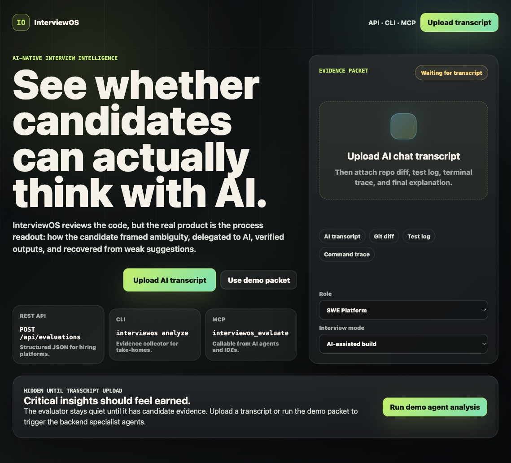
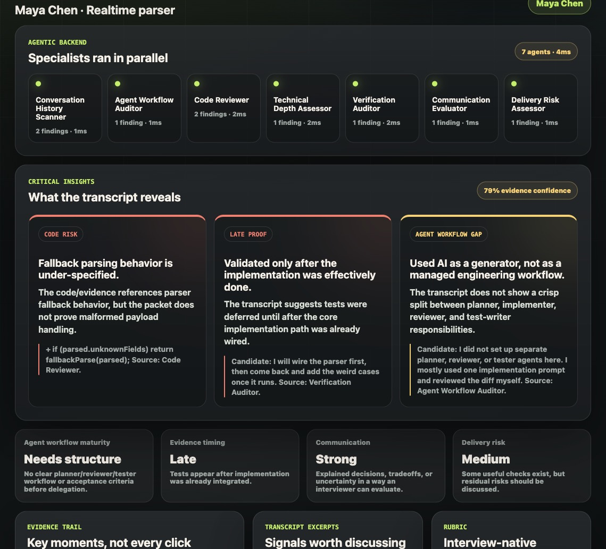

<div align="center">

# InterviewOS

### Evaluate the engineer, not just the code.

InterviewOS is an AI-native interview intelligence platform that reviews a candidate's code, AI transcript, tests, command trace, and final explanation to answer one question:

**Can this person think, verify, communicate, and ship with AI?**

<br />

<strong>Demo UI</strong> · <strong>REST API</strong> · <strong>CLI</strong> · <strong>MCP Server</strong>

</div>

---

## Live Demo Screens

### 1. Open Screen

InterviewOS starts as an interview harness: upload an AI transcript or use the bundled evidence packet. The product is positioned as infrastructure companies can plug into LeetCode, HackerRank, CodeSignal, internal take-homes, or AI IDE workflows.



### 2. After "Use Demo Packet"

The backend runs specialist evaluator agents in parallel, then synthesizes evidence-backed candidate insights. The key artifact is not a generic score; it is a sharp hiring readout grounded in what the candidate actually did.



---

## What It Evaluates

Modern candidates have Codex, Claude, Copilot, Cursor, Antigravity, and other AI-enabled development tools. InterviewOS assumes AI is allowed and evaluates the higher-order signal:

- problem framing
- decomposition
- agent workflow maturity
- technical depth
- verification discipline
- code review judgment
- communication clarity
- delivery risk

Example insight:

> Candidate ran tests only after final implementation and did not add coverage for edge cases. They accepted an AI-generated parser without validating malformed input.

---

## Agentic Backend

An evidence packet can include:

- AI transcript
- Git diff
- test log
- command trace
- final explanation
- role and interview mode

InterviewOS runs specialist evaluators concurrently:

- Conversation History Scanner
- Agent Workflow Auditor
- Code Reviewer
- Technical Depth Assessor
- Verification Auditor
- Communication Evaluator
- Delivery Risk Assessor

The summarizer returns critical insights, scorecard signals, evidence trail, transcript excerpts, specialist reports, and a recommendation.

---

## Available As

| Surface | For | Entry Point |
| --- | --- | --- |
| Demo UI | Hackathon judging and interviewer review | `http://localhost:5173` |
| REST API | Hiring platforms and ATS workflows | `POST /api/evaluations` |
| CLI | Take-homes and local repo analysis | `interviewos analyze --evidence evidence.json` |
| MCP Server | AI IDEs, internal copilots, interview agents | `interviewos_evaluate` |

---

## Run Locally

```bash
npm start
```

Open:

```text
http://localhost:5173
```

Run the CLI demo:

```bash
npm run analyze:demo
```

Run the MCP server:

```bash
npm run mcp
```

---

## API Shape

```http
POST /api/evaluations
Content-Type: application/json
```

```json
{
  "role": "SWE Platform",
  "mode": "AI-assisted build",
  "candidate": {
    "id": "cand_123",
    "name": "Maya Chen",
    "title": "Realtime parser"
  },
  "evidence": {
    "aiTranscript": "Candidate: Before I code, I want to clarify expected behavior...",
    "gitDiff": "diff --git ...",
    "testLog": "PASS parser.test.ts",
    "commandTrace": ["npm test"],
    "finalExplanation": "I chose a local parser to avoid a questionable dependency."
  }
}
```

Structured response includes `critical_insights`, `signals`, `scorecard`, `evidence_trail`, `transcript_excerpts`, `specialist_reports`, and `recommendation`.

---

## Core Thesis

The future of technical interviewing is not banning AI.

The future is evaluating how engineers think with AI.

InterviewOS gives hiring teams the missing layer: process intelligence for AI-assisted engineering.
