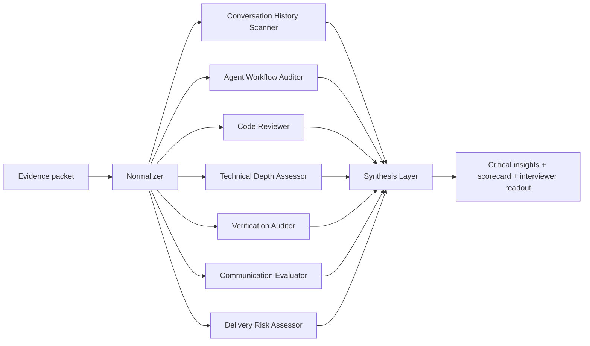

# InterviewOS Agent Architecture

InterviewOS uses a parallel specialist-review workflow.

The backend receives an evidence packet:

- AI transcript
- git diff
- test log
- command trace
- final candidate explanation
- role and interview mode

Then it normalizes the evidence and runs specialist evaluators concurrently.

## Runtime Flow



## Specialist Agents

### Conversation History Scanner

Looks for:

- clarifying questions
- assumptions
- AI skepticism
- passive acceptance of model output
- quote-worthy transcript moments

### Agent Workflow Auditor

Looks for whether the candidate knows how to manage AI like a workflow:

- planner / implementer / reviewer / tester split
- acceptance criteria before delegation
- independent review pass
- overly broad one-shot prompts
- signs of passive vibe coding

### Code Reviewer

Looks for:

- risky generated code
- unvalidated fallbacks
- questionable dependencies
- TODO/FIXME risk
- code issues that connect to transcript behavior

### Technical Depth Assessor

Looks for role-specific engineering judgment:

- edge cases
- data leakage
- rollback behavior
- idempotency
- observability
- security
- latency or throughput
- production constraints

### Verification Auditor

Looks for:

- when tests were run
- whether tests cover edge cases
- whether proof came before or after implementation
- regression fixtures
- failing logs or incomplete coverage

### Communication Evaluator

Looks for:

- tradeoff explanations
- structured reasoning
- uncertainty stated clearly
- final explanation quality

### Delivery Risk Assessor

Turns unresolved evidence gaps into interviewer-facing delivery risk.

## Current Implementation

The current hackathon backend is dependency-free Node.js and deterministic. It does not require an API key to run.

API route:

```http
POST /api/evaluations
```

CLI:

```bash
node bin/interviewos.mjs analyze --evidence data/demo-evidence.json
```

The architecture is intentionally shaped so these deterministic agents can later be swapped for LLM-backed agents or hybrid heuristic + LLM evaluators without changing the frontend contract.

